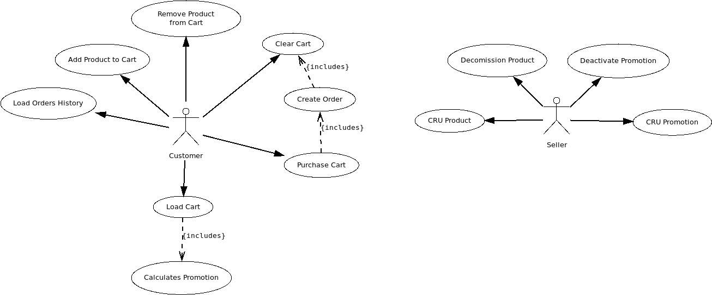

# Shopping Cart Microservice

Hello Jason! Hope you had a great day!

This is my implementation of the challenge proposed (
available [here](https://potent-afternoon-af0.notion.site/Let-s-code-e0bb97fe29ec45aea71f7c5d9bbd633d)).

My goal was to implement something that could be used as a starting point for an actual implementation. Given the
time restrictions, I had to simplify it, at least for an initial status.

I did not share any information about this challenge, neither implemented it in a public GitHub. Currently, it is
only in a private repository at my GitHub.

## Restrictions:

* The entities User, Product, and Promotion have only the bare minimum data required for this challenge.
* I did not implement any product stock validation.
* In the actual implementation, we would need to transmit the customerId (as well as any customer-related data) in
  properly secure headers.
* I assumed each cart would not have many items usually, so I used FetchTYpe.EAGER in JPA mappings, as I need them
  to be loaded immediately to perform calculations; this could be improved depending on the scenarios we expect in
  real world.
* The current code has unit tests implemented using Spock with Groovy, but not full coverage.

## Architectural decisions:

This service is responsible for handling the shopping cart management. In a real-world scenario, I would separate
the product and customer data in their own domains, integrated via secured Rest APIs; however, I simplified this
solution by keeping them together.

## Design decisions:

The "Cart.id" is a simplification of a unique identifier for a given cart. While it is irrelevant for authenticated
users, as each user can only have one cart, it is necessary for non-authenticated users. In the latter case, we
could use a more sophisticated method to identify this cart, store it in both the database and at our client (for
example, in a browser cookie), and only attach it to a user ID after the user has created proper credentials.

Additionally, we could implement a TTL on unauthenticated carts at our persistence layer and subsequently remove
them, ensuring that we do not retain old carts that have no chance of being sold.

Another possibility is to consider Prospect Carts as a different domain, and handle them in a separate microservice.
This would allow us handling infrastructure settings differently for Customers and Prospects, giving us flexibility
to steer our solution according to marketing data, while keeping Customer Carts faster and more stable in the long term.

# Requirements

In order to build and run this application, you will need:

- [JDK 17](https://openjdk.org/projects/jdk/17/);
- [Gradle 4.4](https://docs.gradle.org/4.4.1/release-notes.html) or higher.

In order to just run it, only the Java RE is necessary (17 or higher).

# Running the application

To run this application using the runnable JAR file (sent via e-mail):

* Save the JAR file in any folder;
* Access it via terminal and use the command:
    * **java -jar ./shopping-cart-0.0.1.jar**

# Additional documentation

There are some additional documents, to help you navigate through the implementation. First, there is a (very basic)
web-based definition available in the link below, after the application is properly started:

http://localhost:8083/swagger-ui/index.html

In an actual production-targeting project, I would add details of what each endpoint does, and a better description of
each attribute (it is always helpful to have this kind of document available, especially because it would be kept
up-to-date automatically on every change).

Second, an OpenAPI 3.0 definition in JSON, which could also be useful for API automatic mapping. This can be found
below:

http://localhost:8083/v3/api-docs

Third and last, there is an API Collection to help testing this application without using Swagger. I used Bruno
(https://www.usebruno.com/), which is open-source and easy to use!

The collection is under "src/test/bruno/shopping-cart". To use, just click on "Open Collection" in Bruno's menu.

Thank you!!